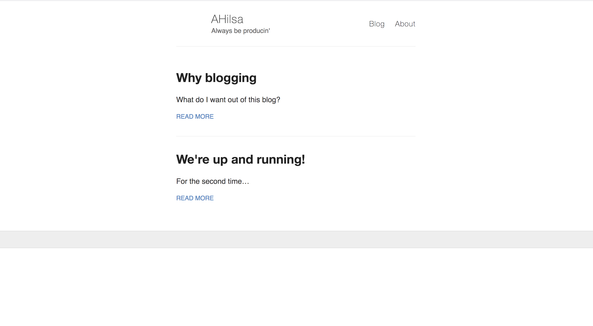
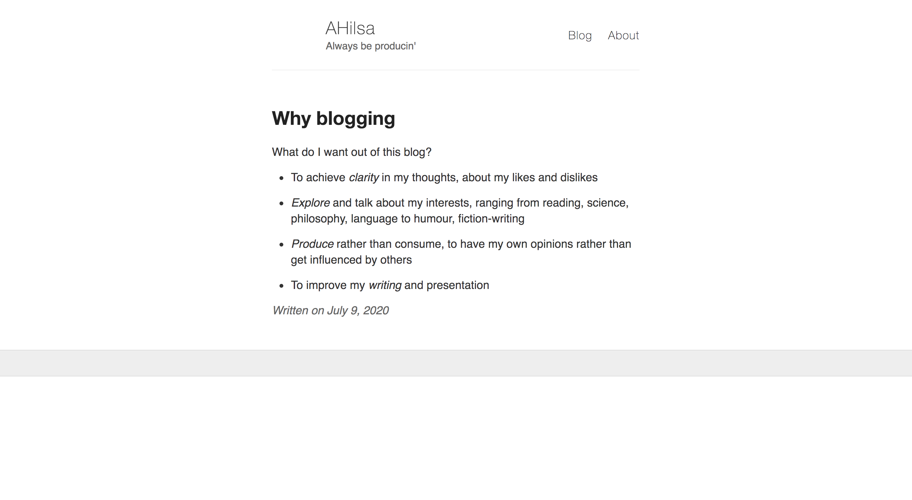

I am experimenting with Sublime Text and Atom. Using Sublime for writing private notes. I am enjoying playing around with the workflow. I love the flexibility of using `git` for my note-taking (as well as blogging). It enables me to do everything locally.

I however want to make the writing experience better. It feels too much like coding for now (is that a bad thing?). One advantage of Atom I'm discovering as I write is that markdown preview is available out of the box. I am sure that Sublime would have this too, tbf.

I have tried to go for a really minimal look for this blog. Here is how it looks right now

I had started with Wordpress but I did not like the interface and also the theme selection. Everything felt really opaque and not fun. I am pretty happy with Jekyll so far. I don't care about the tool as long as I can customize to my heart's content.

I definitely want to give the blog a more aesthetic feel to it. For one, I want to just list the post titles and dates on the front page. Something like the [Thirld Word Blog](https://thirld.com/blog/) (I love the name). The date in the blog post should be at the bottom.

Here is how a blogpost looks right now:

